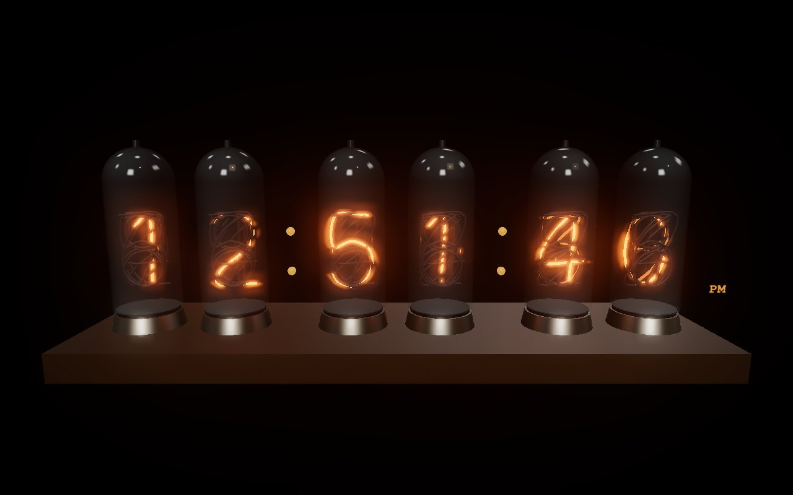

# Generative Hours

**63점의 인터랙티브 제너러티브 아트로 구성된 미디어 아트 전시 웹사이트.**
An interactive generative-art exhibition — 63 works across 13 wings, all running live in the browser.

Live: https://d3acb4zouf8s0e.cloudfront.net/ · https://hanjeongho.github.io/generative-hours/

| | |
|---|---|
|  **01 · Currents** — Perlin 벡터장의 흐름 |  **37 · The Great Wave** — 호쿠사이 페이퍼 시어터 |
|  **45 · Sand Mandala** — 매시간 완성되고 지워지는 모래 시계 |  **47 · Nixie** — 3D 닉시관 시계 |

## 실행 (Run)

빌드 없음 — 정적 서버만 있으면 됩니다:

```
python3 serve.py        # → http://localhost:8777
```

(`serve.py`는 no-cache 헤더를 붙인 간단한 정적 서버입니다. 아무 정적 서버나 사용해도 됩니다.
카메라를 쓰는 작품은 localhost 또는 https에서만 동작합니다.)

## 구조

- `index.html` — 전시 셸 (아트리움 / 갤러리 / 전시실)
- `js/engine.js` — 모든 작품의 공통 베이스 `Piece` 클래스 (RAF 루프, HiDPI, 포인터, 노이즈)
- `js/vision.js` — 카메라 작품용 `VisionPiece` (MediaPipe 손/얼굴 추적 + 커서 폴백)
- `js/three-piece.js` — 3D 작품용 `ThreePiece` (three.js + PBR 환경맵 + 블룸)
- `js/data.js` — 전체 카탈로그(작품·전시관 정의)
- `js/pieces/*.js` — 작품별 엔진 (`export default class extends Piece`)

외부 의존성은 CDN(ES modules)으로만 로드: three.js, MediaPipe Tasks Vision.
캔버스 기법: Canvas2D, raw WebGL(GLSL), three.js — 작품별 최적 선택.

## 라이선스

MIT — [LICENSE](LICENSE) 참조.

