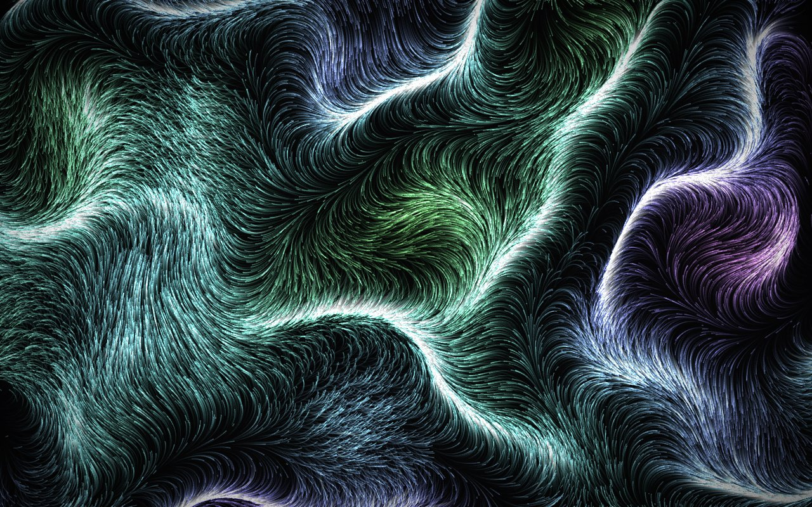
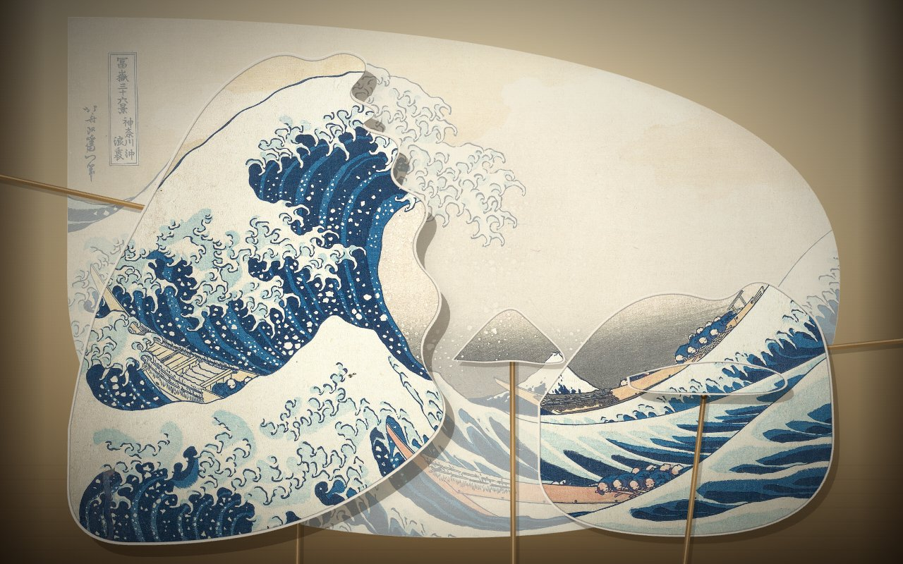
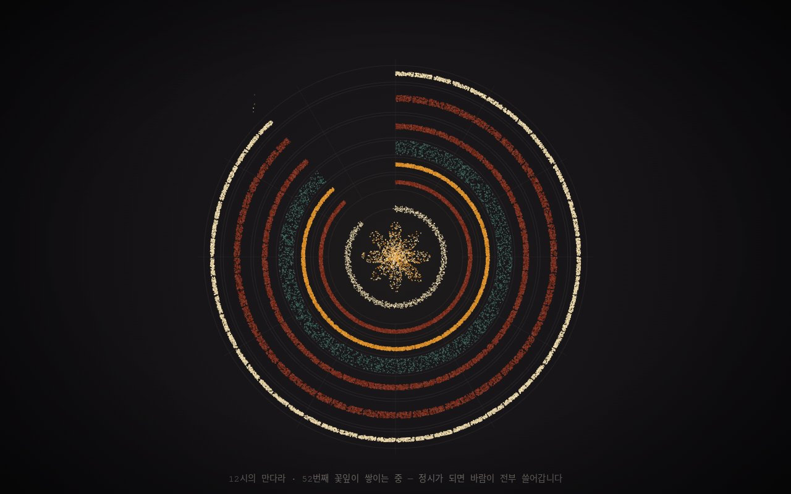
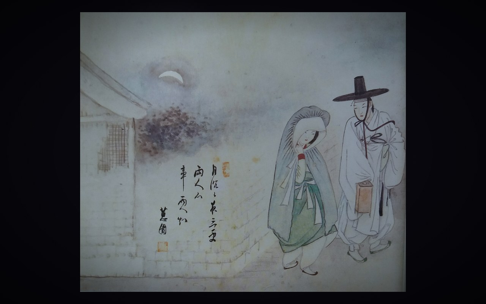

# Generative Hours

**인터랙티브 제너러티브 아트 전시 웹사이트 — 본전시 46작 · 12관, 그리고 두 개의 별관.**
An interactive generative-art exhibition running live in the browser — 46 works across 12 wings,
plus two sister shows: *Beautiful Errors*(착시 10작, `errors.html`) · *Little Hands*(아이들의 카메라 놀이터 12작, `kids.html`).

Live: https://d3acb4zouf8s0e.cloudfront.net/ · https://hanjeongho.github.io/generative-hours/

| | |
|---|---|
|  **01 · Currents** — Perlin 벡터장의 흐름 |  **37 · The Great Wave** — 호쿠사이 페이퍼 시어터 |
|  **45 · Sand Mandala** — 매시간 완성되고 지워지는 모래 시계 |  **89 · Lighting the Lantern** — 신윤복 〈월하정인〉의 밤, 초롱불을 켜는 손 |

## 실행 (Run)

빌드 없음 — 정적 서버만 있으면 됩니다:

```
python3 serve.py        # → http://localhost:8777
```

(`serve.py`는 no-cache 헤더를 붙인 간단한 정적 서버입니다. 아무 정적 서버나 사용해도 됩니다.
카메라를 쓰는 작품은 localhost 또는 https에서만 동작합니다.)

## 구조

- `index.html` — 전시 셸 (아트리움 / 갤러리 / 전시실)
- `js/engine.js` — 모든 작품의 공통 베이스 `Piece` 클래스 (RAF 루프, HiDPI, 포인터, 노이즈)
- `js/vision.js` — 카메라 작품용 `VisionPiece` (MediaPipe 손/얼굴 추적 + 커서 폴백)
- `js/three-piece.js` — 3D 작품용 `ThreePiece` (three.js + PBR 환경맵 + 블룸)
- `js/data.js` — 전체 카탈로그(작품·전시관 정의)
- `js/pieces/*.js` — 작품별 엔진 (`export default class extends Piece`)

외부 의존성은 CDN(ES modules)으로만 로드: three.js, MediaPipe Tasks Vision.
캔버스 기법: Canvas2D, raw WebGL(GLSL), three.js — 작품별 최적 선택.

## 라이선스 (License)

- **코드** — MIT ([LICENSE](LICENSE) 참조): `js/`, `css/`, `*.html`, `serve.py` 등 이 저장소의 소스 코드.
- **`assets/art/` 이미지** — 저자의 창작물이 아니므로 MIT의 적용 대상이 **아닙니다**.
  모두 저작권 보호기간이 만료된 퍼블릭 도메인 회화의 복제 이미지이며, 출처는 아래와 같습니다.
- **`docs/shots/` 스크린샷** — 이 전시 자체의 캡처 (MIT).

### 이미지 출처 (Image credits)

| 파일 | 원작 | 복제 이미지 출처 |
|---|---|---|
| `assets/art/great-wave.jpg` | 가쓰시카 호쿠사이, 〈가나가와 해변의 높은 파도 아래〉 (神奈川沖浪裏, c. 1831) | The Metropolitan Museum of Art, [Accession JP1847](https://www.metmuseum.org/art/collection/search/45434) — Open Access (CC0) |
| `assets/art/the-scream.jpg` | 에드바르 뭉크, 〈절규〉 (1893) — 작가 1944년 몰, 퍼블릭 도메인 | Wikimedia Commons, [The Scream.jpg](https://commons.wikimedia.org/wiki/File:The_Scream.jpg) (PD) |
| `assets/art/sehando.jpg` | 김정희, 〈세한도〉 (歲寒圖, 1844) — 국보 · 국립중앙박물관 소장(손창근 기증) | Wikimedia Commons, [Sehando.jpg](https://commons.wikimedia.org/wiki/File:Sehando.jpg) (PD) |
| `assets/art/wolha.jpg` | 신윤복, 〈월하정인〉 (《혜원전신첩》 중, 국보 제135호) — 간송미술관 소장 | Wikimedia Commons, [Hyewon-Wolha-jeongin-2.jpg](https://commons.wikimedia.org/wiki/File:Hyewon-Wolha-jeongin-2.jpg) (PD) |

원작은 모두 저작자 사후 70년이 지나 저작권이 소멸된 작품들이며, 전시 코드는 원본 픽셀을
훼손하지 않고 그 위에 빛·합성 연출만 얹습니다.

### 서드파티 (Third-party)

저장소에 포함하지 않고 CDN에서 로드합니다:
[three.js](https://threejs.org/) (MIT) ·
[MediaPipe Tasks Vision](https://ai.google.dev/edge/mediapipe/solutions/vision/hand_landmarker) (Apache-2.0, 모델 포함) ·
Google Fonts — Cormorant Garamond · Inter · Space Mono (SIL OFL 1.1)
